<div align="center">

# 🐶 Beagle Chomp

**A maze-chase game where every single pixel is drawn in code.**
No 3D models. No texture files. No audio files. Just TypeScript, three.js and a lot of maths.

### [▶ Play it at beaglechomp.nunoamorim.dev](https://beaglechomp.nunoamorim.dev)

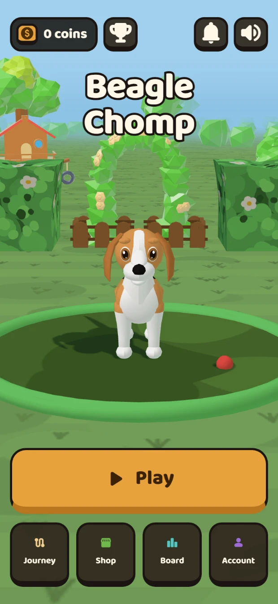

</div>

---

Guide a beagle around a maze, eat every biscuit to clear the map, and chomp a golden bone
to turn the enemies scared and edible. It installs to your phone as a PWA, plays with
swipe, thumbstick, D-pad or keyboard, and keeps a server-validated leaderboard.

It is also, quietly, a study in **procedural content**: the beagle, the eleven enemies,
the six board themes, the neighbourhood you can see past the maze walls, every surface
texture, every sound effect and the ambient bed behind each theme are *generated at
runtime from code*. The repository ships five subset web fonts and a handful of app icons. That is the
complete asset list.

<div align="center">
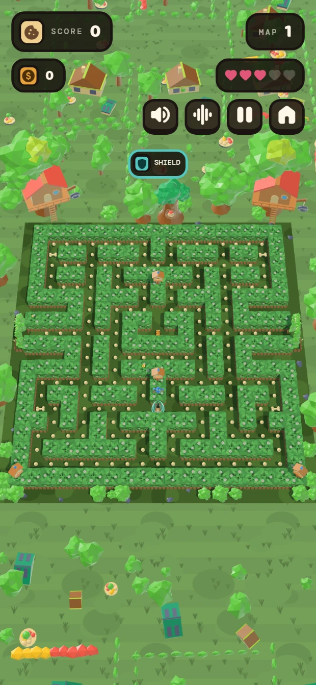
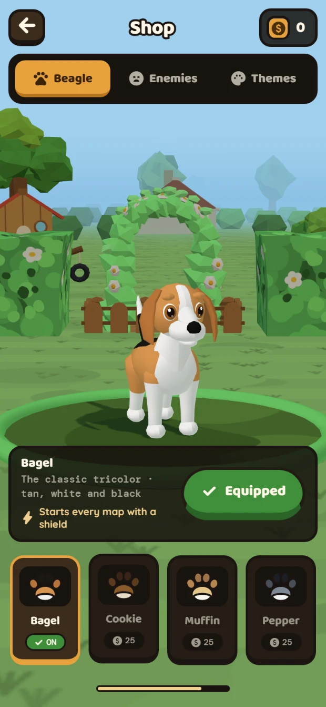
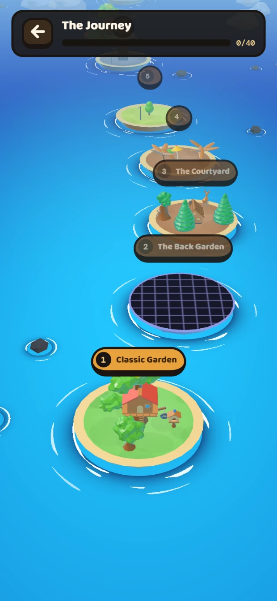
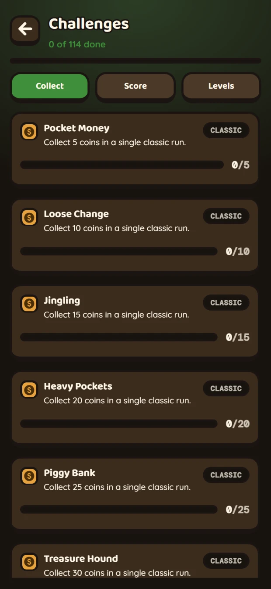
</div>

<div align="center"><sub>Gameplay · the shop · the Journey · challenges</sub></div>

---

## What's in it

| | |
|---|---|
| **36 mazes** | Every one validated headlessly — fully connected, all pellets reachable, enemies can leave the pen, no duplicates. |
| **Two modes** | **Classic** — an endless 30-map cycle in six stages, each closed by a bonus level. **The Journey** — 40 hand-tuned levels: a grand tour of all thirty playable mazes, then ten levels that bend the rules. |
| **114 challenges** | Goals with coin rewards across three categories and both modes. Progress is *derived* from your real run history, so the list fills itself in from games you already played. |
| **5 beagles, 11 enemies, 6 themes** | Every coat carries a **power** — a shield each map, an extra life, double coins, fruit bonuses. Enemies run from a flea and a crab to a walking pizza slice and a stacked hamburger. |
| **5 power-ups** | Doublers, an anchor, a star, and a shield — the one that turns a fatal hit into a survivable one. |
| **Server-validated scores** | A shared leaderboard with a plausibility validator that prices every run against what the game can actually produce. |

## The interesting parts

**Everything is generated.** There is no `.glb`, no `.png` texture, no `.mp3` anywhere in
`src/`. Characters are built from swept solids, revolved profiles and per-triangle
material groups ([`src/render/beagleSculpt.ts`](src/render/beagleSculpt.ts)). Wall and
floor surfaces are painted to a canvas at runtime and tile seamlessly
([`wallTexture.ts`](src/render/wallTexture.ts), [`floorTexture.ts`](src/render/floorTexture.ts)).
Every sound is ~1,600 lines of hand-written Web Audio synthesis
([`sound.ts`](src/ui/sound.ts), [`ambience.ts`](src/ui/ambience.ts)) — including a
different ambient bed per theme, each deliberately pitched outside the frequency band of
the biscuit chomp so the two can never mask each other. Composed music was considered
and rejected: it needs audio files, and in a chase game a melody grates within three
minutes where a texture never does.

**The game logic has no idea three.js exists.** `src/game/*` is pure TypeScript — grid,
tile-stepping movement, enemy AI, the state machine — with a hard rule that it may never
import `three`. That is what makes the headless test suite possible: `npm run test` runs
the *real* modules in Node, with a pathfinding bot that has to clear all 36 boards to
100% before the suite passes.

**A built-in 3D editor.** `npm run editor` opens a dev-only workbench over the real
meshes: a part tree, a transform gizmo, multi-select, an animation timeline, undo, glTF
import/export — and **it writes its changes back into the actual source files** as
three.js constructor calls. Six tabs cover characters, pickups, board themes, props,
balance numbers and world machinery. It is not a rollup input, so it never ships.

**Draw calls are the budget, not triangles.** The whole maze is one `InstancedMesh`. The
surrounding neighbourhood — hundreds of houses, hedges, trees and flower beds — is merged
by material signature into ~14 draw calls, and culled to the frame's actual ground
footprint, which cuts a phone's surround geometry by about 65%.

**Two art directions ship side by side.** The game is *authored* cel-shaded — one shared
three-step toon ramp, `NoToneMapping` — and then restyled at runtime into a matcap look
over a snapped high-key palette ([`madboxStyle.ts`](src/render/madboxStyle.ts)). Both are
live; the profile screen has the switch.

### The six boards

<div align="center">
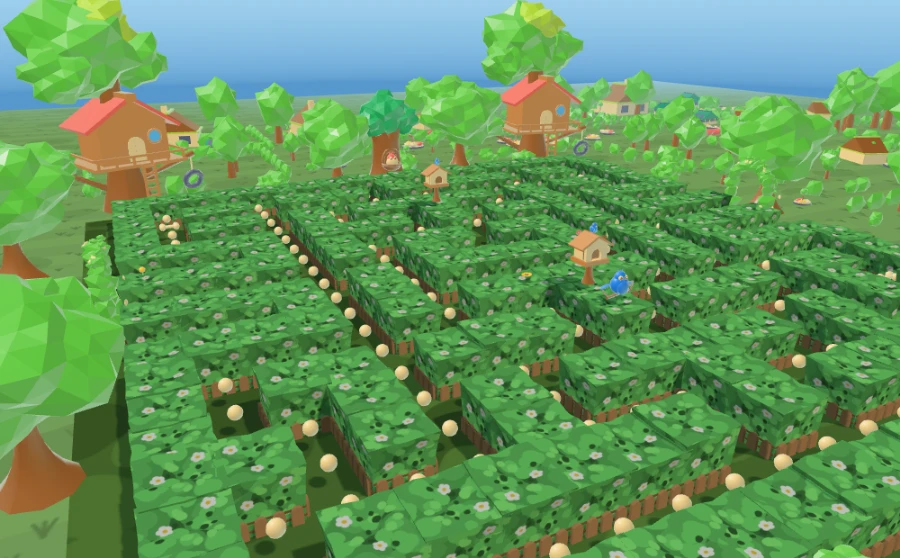
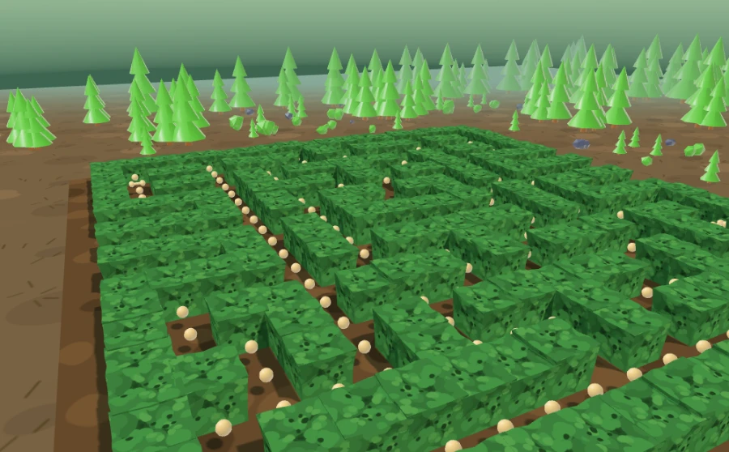
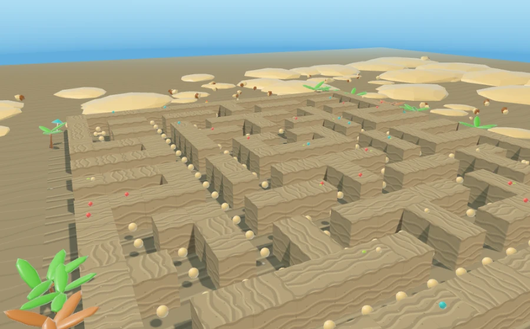
<br>
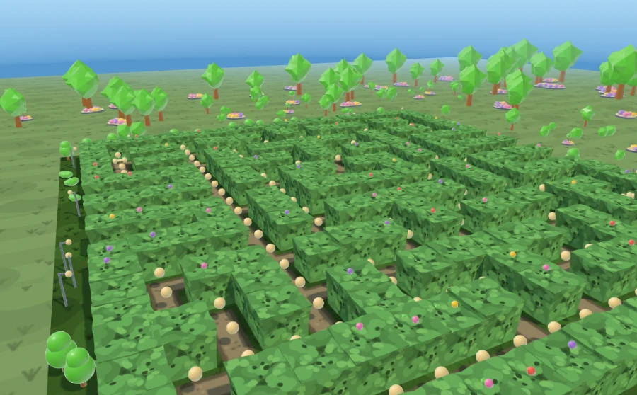
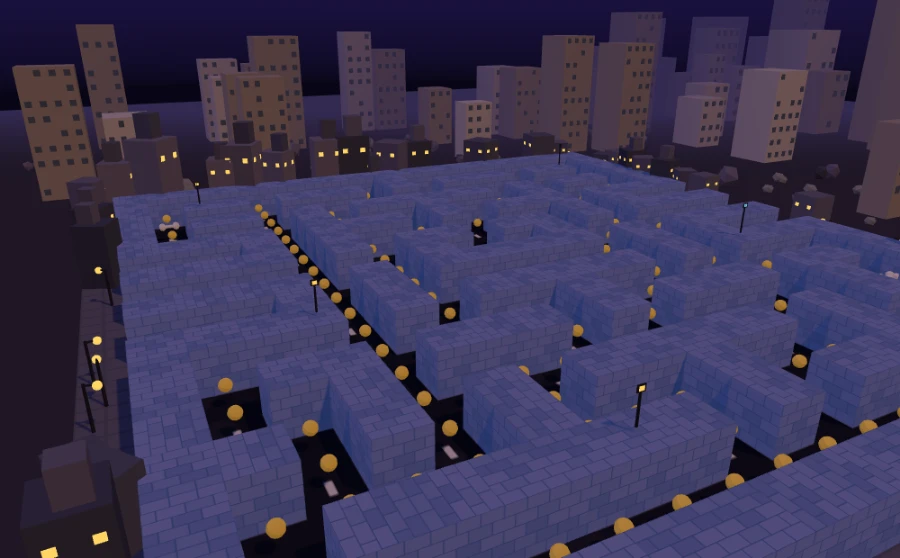
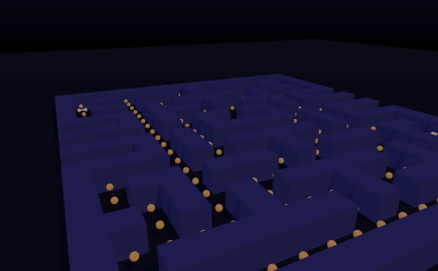
</div>

*The Garden · Deep Forest · Sunny Beach — City Park · Night City · Arcade Night.
Arcade Night is a deliberate exception to the new art direction: it is a night theme, and
brightening it would have undone the thing it exists for.*

## Tech

**Frontend** — three.js r169 (WebGL) · TypeScript (strict) · Vite · vite-plugin-pwa
**Backend** — Hono · Node 22 · Postgres (`pg`, no ORM) · argon2id · zod
**Tests** — 50 suites: pure logic ones that run in Node, plus Playwright ones that
drive the real app
**Hosting** — Cloudflare Pages (frontend) · Docker on a VPS via Dokploy (API)

No physics engine, no post-processing, no asset loader. Movement is tile-stepping on a
grid; 1 world unit = 1 maze tile.

## Running it

```bash
npm install
npm run dev          # the game at localhost:5173
npm run test         # the headless logic suites — no browser, no database
npm run build        # typecheck + production build
```

The game requires sign-in, so `npm run dev` alone will stop at the auth gate. For the full
stack:

```bash
cp .env.example .env         # VITE_API_URL=http://localhost:3001
docker compose up db api     # Postgres + the API (migrations run on start)
npm run dev                  # in a second terminal
```

Everything in Docker instead: `docker compose --profile full up`.
See [`server/README.md`](server/README.md) for the API on its own.

### Dev-only pages

| Page | What it is |
|---|---|
| `/editor/` | The mesh, theme, prop and balance workbench (`npm run editor`). |
| `/preview/` | The real beagle with orbit controls, preset cameras and part isolation. |
| `/preview-board/?theme=garden&view=game` | Any board theme at any camera, including a clay render (`&flat=1`). |
| `/preview-journey/` | The island map, with `?style=classic` as the A/B. |
| `/preview-rework/?model=crab` | Any enemy skin, with `?state=frightened`, `?fov=`, `?bg=none`. |

None of them are rollup inputs, so none of them ship.

### Tests

```bash
npm run test               # 26 pure suites — maze validation, the sim, and the rest
npm run validate           # maze connectivity and reachability
npm run sim                # a pathfinding bot must clear all 36 boards
npm run test:editor        # the editor suites (Playwright)
npm run test:menu-ui       # one of the suites that drives the real app
```

Anything touching `src/game/{grid,movement,ghostAI}.ts` or the maze data has to pass
`npm run test` before it counts as done. Changing `config.ts`, `mazes.json`, `journey.ts`
or `challenges.ts` also means `npm run sync` inside `server/` — the validator's constants
are generated from the real game modules, and drift means honest runs start getting
rejected.

## Layout

```
src/game/      pure logic — never imports three. Grid, movement, AI, state, config,
               36 mazes, cosmetics, themes, the Journey ladder, 114 challenges
src/render/    three.js — scene, board, characters, props, surround, the art direction
src/ui/        DOM chrome — HUD, shop, leaderboard, challenges, sound + ambience
src/input/     keyboard · swipe · D-pad · thumbstick
src/editor/    the dev-only workbench (nothing in the game imports from it)
server/        the API — Hono + Postgres + argon2id, own Dockerfile and migrations
admin/         the metrics portal (its own build, its own Pages project)
scripts/       50 test suites + ~100 measuring instruments and review sheets
docs/          architecture, game design, and the historical planning notes
Idea-Ledger/   what is built, what shipped, and what is next
```

## Documentation

- [`docs/ARCHITECTURE.md`](docs/ARCHITECTURE.md) — the layer rules, the coordinate system, the editor, the render pipeline
- [`docs/GAME_DESIGN.md`](docs/GAME_DESIGN.md) — entities, scoring, AI, progression, the economy
- [`server/README.md`](server/README.md) — the API, its migrations, its observability
- [`STACK.md`](STACK.md) — the platform conventions the backend deploys onto
- [`Idea-Ledger/`](Idea-Ledger/) — every feature's history, and the full release log
- [`CLAUDE.md`](CLAUDE.md) — the engineering notebook. Long, and the most honest file here:
  it records what each decision cost, which instruments lied, and which bugs shipped.

## Built with Claude Code

This whole thing was built in collaboration with [Claude Code](https://claude.com/claude-code).
`.claude/agents/` holds six project agents (architect, gameplay, render, PWA, QA, level
design) alongside fourteen three.js specialists, and `CLAUDE.md` is the shared memory they
work from. If you are curious what an AI-assisted codebase actually looks like sixteen
releases in, that file is the answer — including the parts where the measuring instrument
turned out to be wrong before the code was.

## License

[MIT](LICENSE). Use it, learn from it, build on it.

The one thing that is *not* MIT is the reference imagery some characters were modelled
from: those are watermarked stock photographs, kept out of the repository entirely
(`.img2threejs/` is gitignored), and no pixel of any of them is used as colour or texture
evidence. Every mesh here is original geometry.
